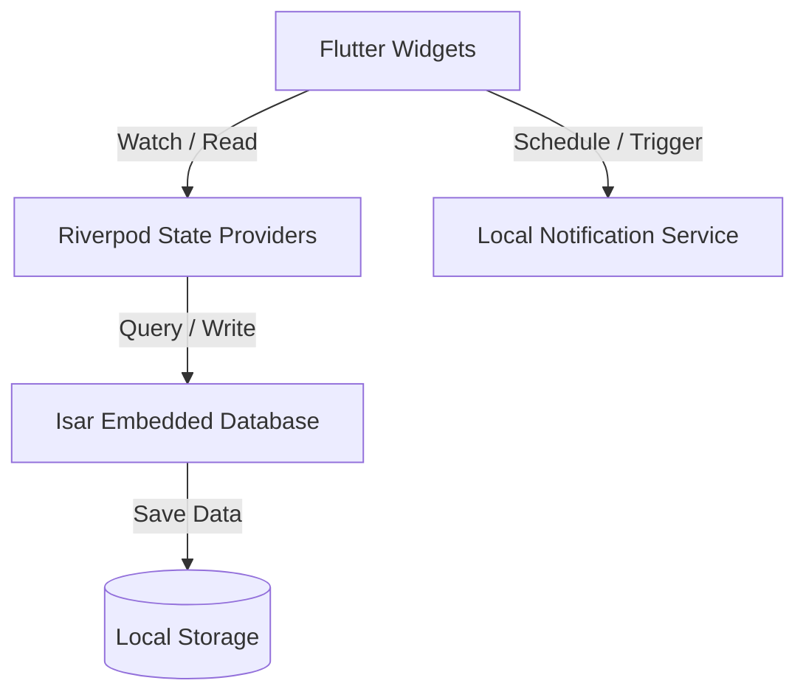

# DayLog Design Document

DayLog is a minimalist, privacy-first, offline time-tracker and daily journal designed to help developers monitor their daily focus and reflect on their progress.

---

## 🎨 Design Philosophy & Themes

DayLog focuses on a distraction-free environment that values visual clarity, premium look-and-feel, and instant reactivity.

### Typography
* **Primary Font**: `Inter` — chosen for its high readability on small screens.
* **Timer Displays**: Uses `FontFeature.tabularFigures()` to enforce monospacing on numeric values. This prevents layout shifting and screen jittering while the timer counts up.

### Color Systems
The application uses curated, harmonious color palettes to organize tasks and highlight statuses.
* **Light Theme**: Dominated by soft bone/white backgrounds (`0xFFF8F8F6`) and deep forest green primary accents (`0xFF1D9E75`).
* **Dark Theme**: Minimalist dark background (`0xFF0F0F10`) paired with a vibrant, glowing teal accent (`0xFF2EC4B6`).
* **Categories**: Each category is mapped to a distinct premium color token:
  * **Learning**: Blue (`0xFF4A90E2`)
  * **DSA**: Cyan (`0xFF00BCD4`)
  * **System Design**: Terracotta Red (`0xFFFF5722`)
  * **Content**: Muted Orange (`0xFFFFA500`)
  * **Play Time**: Light Green (`0xFF8BC34A`)
  * **Job Hunt**: Rose Pink (`0xFFE91E63`)
  * **Other**: Muted Grey (`0xFF888780`)

---

## 🏗️ Technical Architecture

### 1. Database Schema (Isar Collections)

#### TaskEntry
Represents a recorded interval of active focus.
* `id`: Auto-incrementing primary key.
* `title` (String): What the user was working on.
* `category` (String): Indexed string matching one of the categories.
* `startedAt` (DateTime): Start time.
* `stoppedAt` (DateTime?, nullable): End time.
* `durationSeconds` (int): Tracked interval duration.
* `dayKey` (String, indexed): Derived date string (`yyyy-MM-dd`) used for grouping tasks.

#### JournalEntry
Represents an end-of-day reflection. Only one entry is allowed per day.
* `id`: Auto-incrementing primary key.
* `dayKey` (String, unique index): The date key (`yyyy-MM-dd`).
* `shipped` (String): Summary of accomplishments.
* `blockers` (String): Obstacles or blockers faced.
* `improved` (String): Learnings and personal improvements.
* `tomorrow` (String): Priorities set for the next day.
* `createdAt` (DateTime): Creation timestamp.
* `totalTrackedSeconds` (int): Aggregated focus time for the day (denormalized for fast rendering).

---

## ⚡ Key Architectural Optimizations

### 1. Battery-Saving App Ticker
To display the live running timer without killing device battery, DayLog centralizes timer updates in `AppTickerNotifier`:
* Instead of running individual timers in every widget, a single periodic 1-second timer runs globally.
* The timer automatically pauses when the active task is paused or when the application enters the background (`AppLifecycleState.paused`), saving CPU cycles.
* It resumes automatically when the app returns to the foreground.

### 2. Synchronization of Dismissible Widgets
To prevent Flutter’s `"A dismissed Dismissible widget is still part of the tree"` assertion crash when deleting completed tasks:
* The completed task section renders a sub-filtered list.
* Swiping to delete immediately records the task ID in a local widget set (`_dismissedIds`) and calls `setState`.
* This removes the widget from the tree synchronously.
* The background deletion query runs asynchronously, updating the Isar database and invalidating the Riverpod query when complete.

### 3. Contextual Data Sharing (Yesterday's Priority)
To close the feedback loop between days, the reflection form fetches yesterday's journal record and shows the user a highlighted **"Yesterday's Priority"** card at the top. This helps the user review whether they accomplished their main goal for the day before filling out today's journal.
